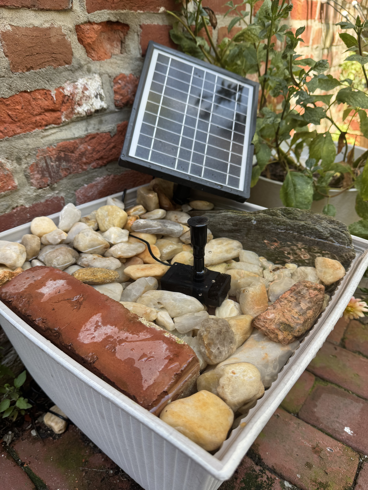

<!-- SCAFFOLD. Placeholder copy to rewrite in your own words, then delete these comment lines. -->

A sentence or two on what this is and why you started building it.

## How it's going

Where it stands right now: what's working, what's still rough, what's next.

## Notes

Anything you learned or want to remember: the plants around it, who's been visiting, what you'd do differently.

<!-- Add photos when ready: drop files in src/assets/images/ and reference them like:
 -->
